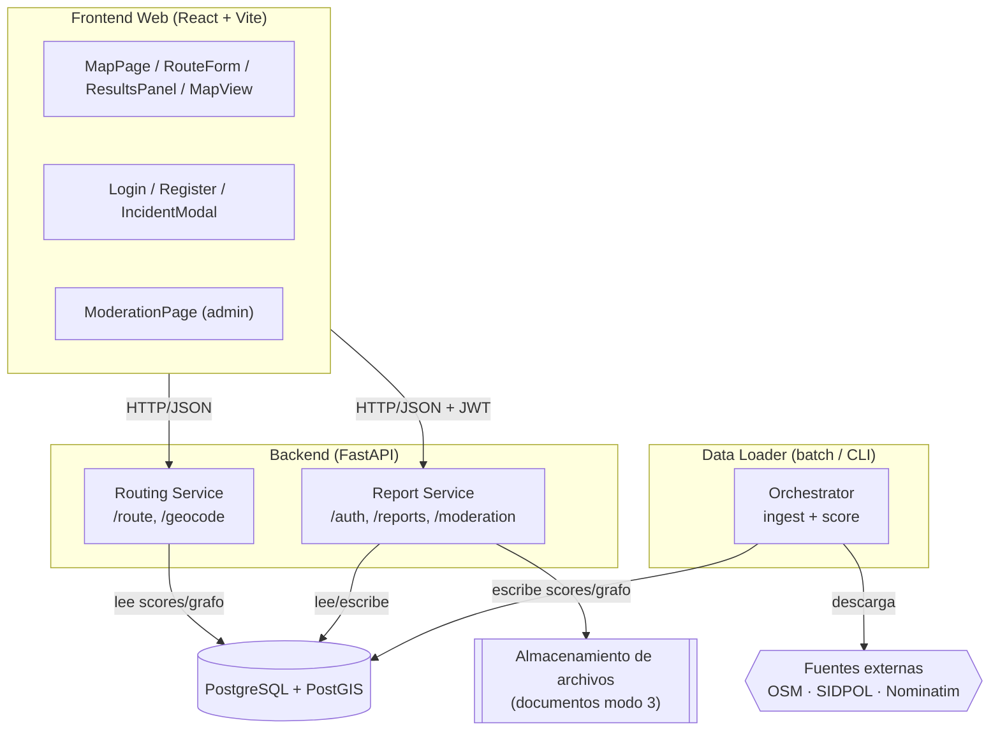
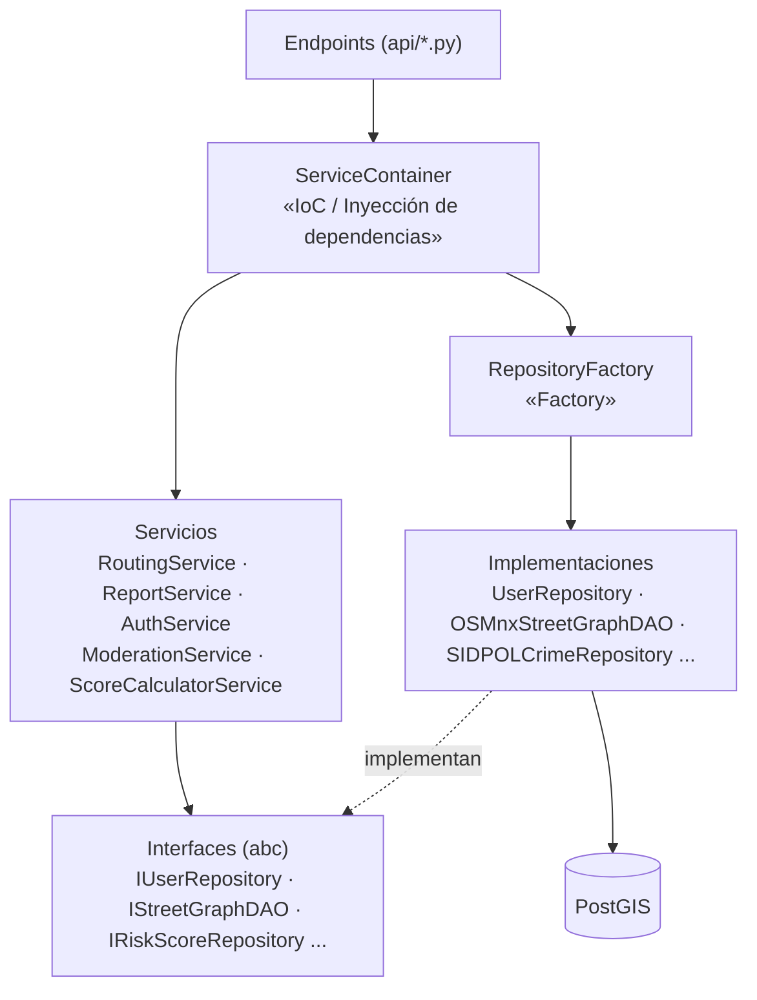
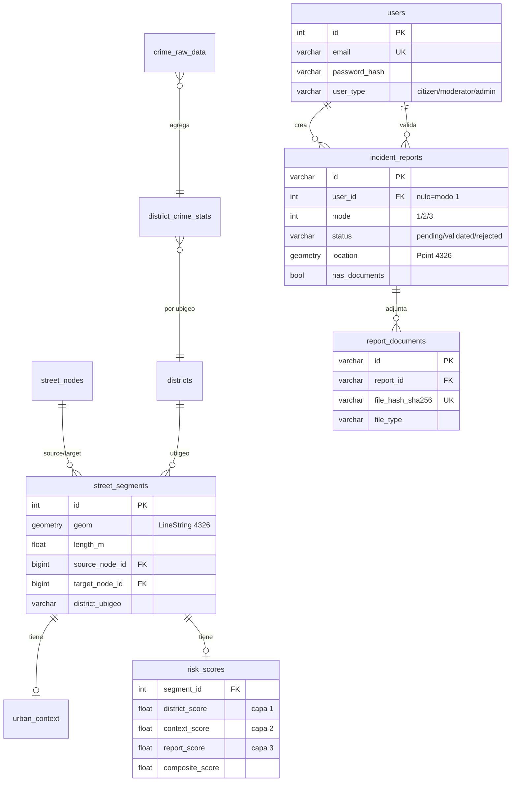

# Documento de Arquitectura de Software (DAS) — SafeRoute

Documento que complementa al SRS y describe la arquitectura del sistema. Los patrones de diseño se detallan en las secciones 4 y 6.

## 1. Propósito y alcance

SafeRoute es una plataforma web de ruteo peatonal optimizado por seguridad para ciudades del Perú. Este documento describe la arquitectura del sistema: sus componentes, el modelo de datos, la organización de clases por capas y los patrones de diseño aplicados.

## 2. Estilo arquitectónico

- **Servicios desacoplados con base de datos como punto de integración.** El sistema se divide en tres servicios lógicos independientes —**Routing**, **Report** y **Data Loader**— que solo se comunican a través de la base de datos (RD-06).
- **Pre-cálculo (RD-05).** Los scores de riesgo se calculan por lotes y se almacenan; la API de ruteo nunca llama a fuentes externas en tiempo de consulta, garantizando respuestas < 3 s.
- **Arquitectura en capas** dentro de cada servicio: `API (FastAPI) → Servicios → Repositorios/DAO (tras interfaces) → Base de datos`.
- **API REST stateless** con autenticación JWT para las operaciones que lo requieren.

## 3. Vista de componentes

| Componente | Responsabilidad | Tecnología |
| --- | --- | --- |
| Frontend Web | Mapa interactivo, consulta de rutas, reportes, login y panel de moderación | React, Vite, React-Leaflet, React-Router |
| Routing Service | Calcula ruta segura/corta (Dijkstra ponderado) y geocodifica | FastAPI, NetworkX |
| Report Service | Cuentas (JWT), reportes modos 1/2/3, documentos y moderación | FastAPI, PBKDF2, PostGIS |
| Data Loader | Ingesta OSM/SIDPOL y cálculo de scores compuestos | OSMnx, GeoPandas, Pandas |
| Base de datos | Grafo, scores pre-calculados, usuarios y reportes | PostgreSQL + PostGIS |

## 4. Vista de capas y clases (con patrones)

- **Capa API** (`backend/app/api/`): endpoints REST. No contienen lógica de negocio; delegan al `ServiceContainer`.
- **Capa de servicios** (`backend/app/services/`): reglas de negocio (ruteo, scoring, reportes, moderación, auth).
- **Capa de acceso a datos** (`backend/app/repositories/`): repositorios y DAOs, **cada uno detrás de una interfaz** (`backend/app/interfaces/`).
- **Modelos** (`backend/app/models/`): entidades ORM SQLAlchemy que mapean las tablas.

## 5. Modelo de datos

Tablas (13): `street_nodes`, `street_segments`, `districts`, `district_crime_stats`, `crime_raw_data`, `crime_types_weights`, `urban_pois`, `urban_context`, `risk_scores`, `data_load_log`, `users`, `incident_reports`, `report_documents`. PostGIS provee las geometrías e índices GiST (incl. `geography` para `ST_DWithin`).

## 6. Patrones de diseño aplicados

| Patrón | Dónde (archivo:clase) | Propósito |
| --- | --- | --- |
| **Repository** | `repositories/user_repository.py`, `incident_report_repository.py`, `risk_score_repository.py` | Abstraer el acceso a datos; el servicio no conoce SQL |
| **DAO** | `repositories/osmnx_street_graph_dao.py`, `district_dao.py`, `osmnx_context_dao.py` | Acceso a fuentes geoespaciales (OSM) |
| **Factory** | `repositories/factory.py:RepositoryFactory` | Centralizar la creación de repositorios/DAOs |
| **Inyección de dependencias / IoC** | `core/service_container.py:ServiceContainer` | Resolver e inyectar dependencias de servicios |
| **Singleton** | `db/session.py` (engine/SessionLocal); caché de `ServiceContainer` | Única fábrica de sesiones; instancias únicas por request |
| **Strategy** | Interfaces `interfaces/*.py` + implementaciones intercambiables (`ICrimeRepository`→SIDPOL, `IStreetGraphDAO`→OSMnx) | Cambiar fuente/algoritmo sin tocar la lógica (DIP/OCP) |
| **Template Method** | `repositories/sidpol_repository.py` (`download → parse → save`) | Flujo de ingesta estandarizado y extensible |
| **Facade** | `services/*_service.py` | Exponer operaciones de alto nivel a los endpoints, ocultando la orquestación interna |

> Los principios SOLID que sostienen estos patrones están documentados en `docs/SAF-37-solid.md`.

## 7. Decisiones arquitectónicas clave

1. **BD como único punto de integración**: si el Data Loader falla, la API sigue sirviendo con los últimos scores. (RD-06)
2. **Pre-cálculo de scores**: la consulta de ruta no depende de fuentes externas en tiempo real. (RD-05)
3. **Interfaces sobre implementaciones**: permite sustituir fuentes de datos (p. ej. otra fuente de criminalidad) sin modificar servicios. (DIP)
4. **Autenticación por rol**: `citizen` / `moderator` / `admin`; documentos de modo 3 accesibles solo a moderadores. (Ley N.° 29733)
