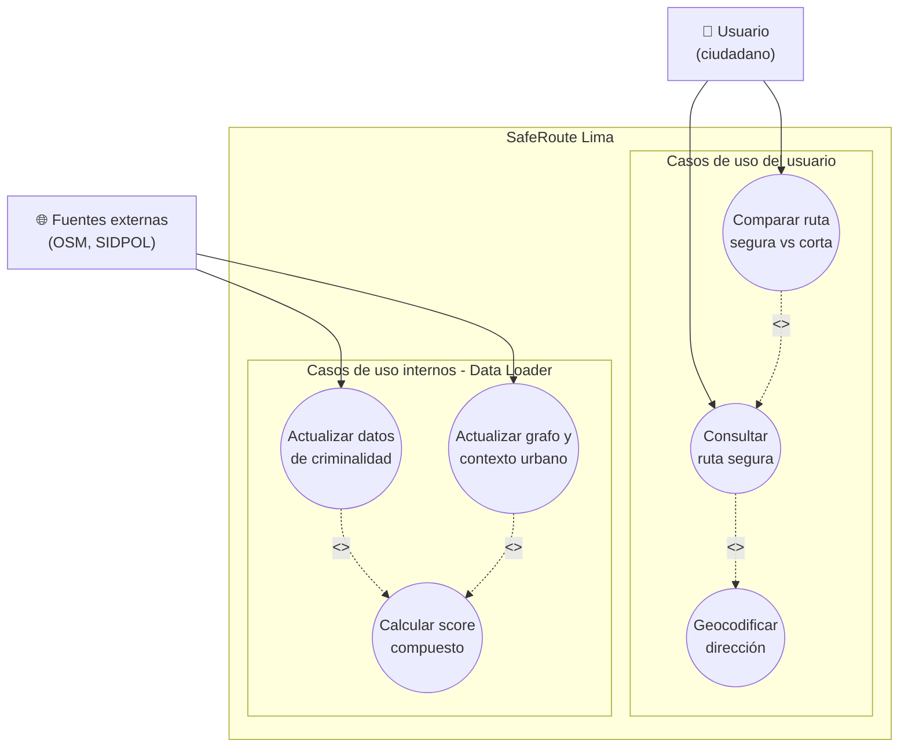
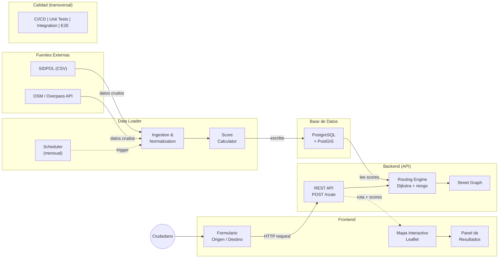

# SAF-13: Diagramas del Sistema SafeRoute Lima

## 1. Diagrama de Casos de Uso

> **Nota**: Mermaid no soporta diagramas UML de casos de uso nativamente. El gráfico anterior es una representación aproximada. Las tablas siguientes contienen la especificación formal.

### Actores

| Actor | Descripción |
|-------|------------|
| Usuario (ciudadano) | Persona que consulta rutas peatonales seguras en Lima Metropolitana |
| Fuentes externas (OSM, SIDPOL) | Sistemas externos que proveen datos de criminalidad y contexto urbano |

### Casos de uso del usuario

| Caso de uso | Tipo | Descripción |
|-------------|------|-------------|
| Consultar ruta segura | Principal | El usuario ingresa origen y destino, y recibe la ruta peatonal más segura |
| Comparar ruta segura vs ruta corta | `<<extend>>` de Consultar ruta segura | Opcionalmente, el usuario puede ver ambas rutas para decidir si el desvío vale la pena |
| Geocodificar dirección | `<<include>>` de Consultar ruta segura | Se ejecuta automáticamente cuando el usuario ingresa una dirección en texto |

### Casos de uso internos (Data Loader)

| Caso de uso | Descripción |
|-------------|-------------|
| Actualizar datos de criminalidad | Descarga y procesa CSV de SIDPOL. Se ejecuta mensualmente |
| Actualizar grafo y contexto urbano (OSM) | Extrae grafo de calles y datos de contexto (comisarías, iluminación, cámaras) de OpenStreetMap |
| Calcular score compuesto | Genera el índice de riesgo por segmento combinando la tasa distrital y el contexto urbano. Se ejecuta después de cada actualización de datos |

### Relaciones

- `Consultar ruta segura` --`<<include>>`--> `Geocodificar dirección`
- `Consultar ruta segura` <--`<<extend>>`-- `Comparar ruta segura vs ruta corta`
- `Actualizar datos de criminalidad` --`<<include>>`--> `Calcular score compuesto`
- `Actualizar grafo y contexto urbano` --`<<include>>`--> `Calcular score compuesto`

### Notas

- Los casos de uso internos se ejecutan de forma programada (mensual), no son iniciados por el usuario.
- DATACRIM fue descartado como fuente porque sus datos georreferenciados se sirven como imágenes (WMS/ArcGIS tiles) y no están disponibles para descarga con coordenadas.

---

## 2. Diagrama de Componentes

### Subsistemas

### Descripción de componentes

| Componente | Responsabilidad | Tecnología |
|------------|----------------|------------|
| Data Loader - Ingestion | Descarga CSV de SIDPOL, datasets MININTER, y grafo/contexto de OSM. Normaliza a schema común | Python (requests, OSMnx, Overpass API) |
| Data Loader - Score Calculator | Calcula score compuesto por segmento: capa distrital (tasa criminalidad) + capa contexto urbano (comisarías, iluminación, etc.) | Python + PostGIS (ST_Within, ST_DWithin) |
| Data Loader - Scheduler | Orquesta la ejecución periódica (mensual) de ingesta + cálculo | Python (cron / scheduled task) |
| Base de Datos | Almacena scores pre-calculados, grafo de calles, tasas distritales, contexto urbano, logs de ejecución | PostgreSQL + PostGIS |
| API REST | Recibe coordenadas origen/destino, consulta scores pre-calculados, ejecuta ruteo, devuelve ruta como GeoJSON | Python (FastAPI) |
| Routing Engine | Implementa Dijkstra ponderado donde peso = f(distancia, risk_score) | Python (NetworkX o pgRouting) |
| Frontend - Formulario | Campos de origen/destino con autocompletado + botón de búsqueda | React + Vite |
| Frontend - Mapa | Renderiza Lima, permite click para seleccionar puntos, dibuja rutas con colores por riesgo | React + Leaflet |
| Frontend - Panel Resultados | Muestra score global, categoría (Segura/Moderada/Riesgosa), distancia, tiempo estimado | React |

### Decisiones arquitectónicas clave

1. **Pre-cálculo de scores**: Los scores se calculan mensualmente y se almacenan. La API nunca accede a fuentes externas en tiempo de consulta. Esto garantiza respuestas rápidas (<3s) y desacopla la disponibilidad de la API del estado del Data Loader.

2. **Base de datos como punto de integración**: El Data Loader escribe en la BD, la API lee de la BD. Son componentes independientes. Si el Data Loader falla, la API sigue funcionando con los últimos scores calculados.

3. **Score de dos capas**: Capa 1 (distrital) usa tasas de criminalidad de SIDPOL/MININTER. Capa 2 (segmento) usa factores de contexto urbano de OSM. Esto compensa la falta de datos georreferenciados a nivel de calle.

### Tablas de la base de datos

| Tabla | Descripción |
|-------|-------------|
| `street_segments` | Segmentos de calle del grafo OSM (geometría LineString, nodos, UBIGEO del distrito) |
| `district_crime_rates` | Tasas de criminalidad por distrito y periodo (total, violentos, patrimoniales, tasa ponderada) |
| `urban_context` | Factores de contexto por segmento (comisarías cercanas, iluminación, tipo de vía, POIs) |
| `risk_scores` | Scores compuestos pre-calculados por segmento (district_score + context_score = composite_score) |
| `data_load_log` | Log de ejecuciones del Data Loader (source, timestamps, registros procesados, status) |